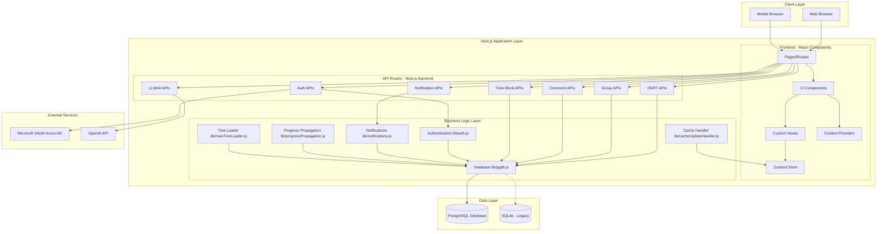
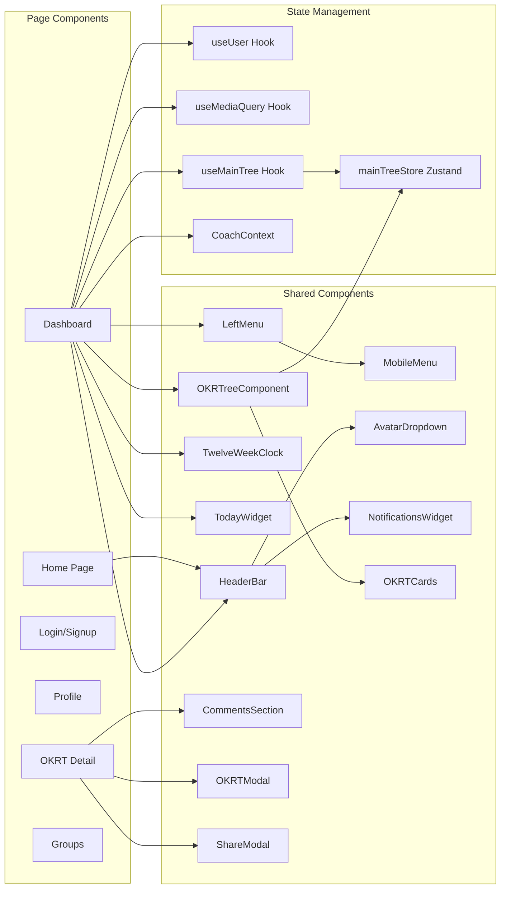
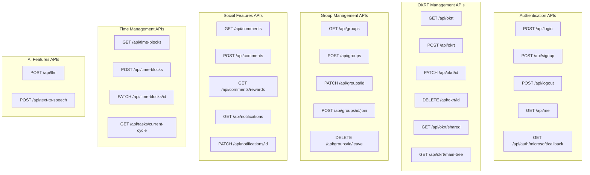
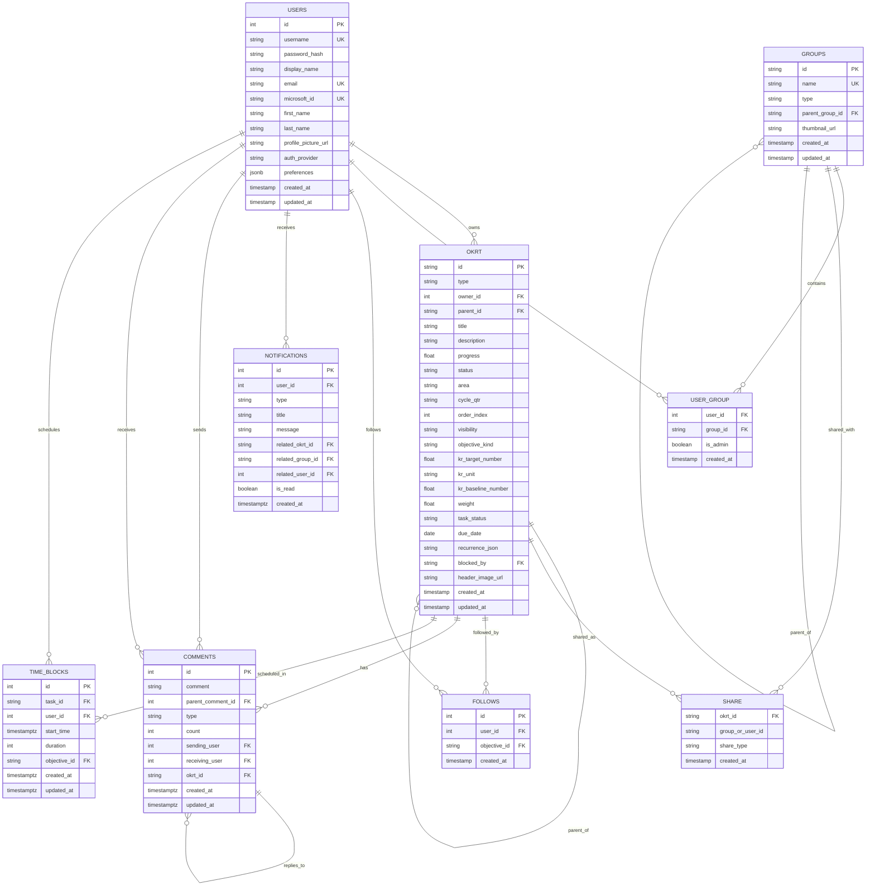
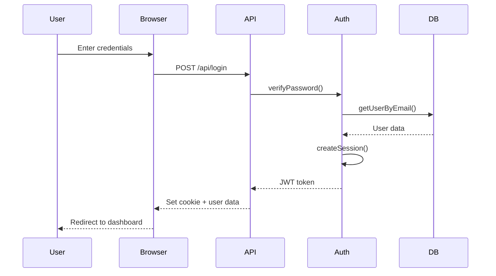
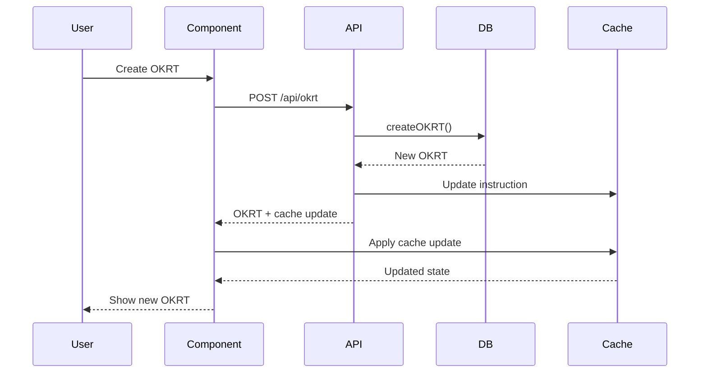
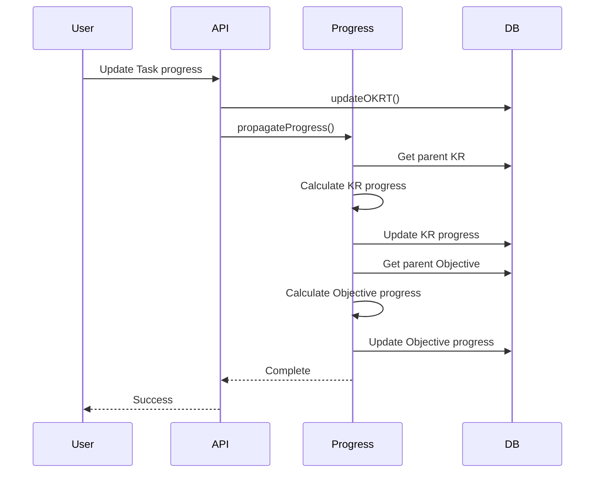

# 90 Days Goal & Coaching App - Architecture Documentation

## System Architecture Overview



## Detailed Component Architecture

### 1. Frontend Architecture



### 2. API Routes Architecture



### 3. Database Schema Architecture



## Technology Stack

### Frontend
- **Framework**: Next.js 15.5.3 (App Router)
- **Language**: JavaScript (React 19.1.0)
- **UI Libraries**: 
  - Material-UI (@mui/material, @mui/x-tree-view)
  - PrimeReact
  - Lucide React Icons
  - React Icons
- **State Management**: 
  - Zustand (global state)
  - React Context (theme, coach)
  - Custom Hooks (user, media query, main tree)
- **Styling**: CSS Modules + Theme Variables
- **Tree Visualization**: React Arborist, TidyTree

### Backend
- **Runtime**: Node.js with Next.js API Routes
- **Authentication**: 
  - JWT (jose library)
  - NextAuth.js (Microsoft OAuth)
  - bcryptjs (password hashing)
- **Database**: 
  - PostgreSQL (primary - pg library)
  - SQLite (legacy support - sqlite3)
- **AI Integration**: OpenAI API

### Database
- **Primary**: PostgreSQL with connection pooling
- **Schema Management**: SQL migration scripts
- **Features**:
  - Automatic timestamp updates
  - Cascading deletes
  - JSONB for preferences
  - Full-text search ready

## Key Features by Phase

### Phase 1-2: Foundation
- User authentication (email/password)
- Microsoft OAuth integration
- Profile management
- Responsive navigation

### Phase 3: OKR Framework
- Objectives, Key Results, Tasks (OKRT) hierarchy
- Progress tracking
- Status management
- Cycle/quarter organization

### Phase 6: Collaboration
- Groups (Organization, Department, Team, etc.)
- User-group relationships
- OKRT sharing with groups/users
- Group hierarchy

### Phase 7: Social Features
- Following shared objectives
- Visibility controls
- Ownership management

### Phase 8: Notifications
- Real-time notification system
- Multiple notification types
- Read/unread tracking
- Related entity linking

### Phase 9: Engagement
- Comments system
- Threaded replies
- Rewards (medals, stars, cookies)
- Reward aggregation

### Phase 11: Time Management
- Time blocking
- Task scheduling
- Calendar integration
- Duration tracking

### Phase 14: AI Features
- LLM-powered coaching
- Text-to-speech
- Intelligent suggestions

## Data Flow Patterns

### 1. Authentication Flow


### 2. OKRT Creation Flow


### 3. Progress Propagation Flow


## Security Architecture

### Authentication & Authorization
- JWT-based session management
- HTTP-only cookies
- 7-day token expiration
- Password hashing with bcrypt (12 rounds)
- Microsoft OAuth integration

### Data Access Control
- User-owned OKRT filtering
- Group membership validation
- Share permission checks
- Admin role verification

### API Security
- Session validation on all protected routes
- User ID verification from JWT
- Input validation and sanitization
- SQL injection prevention (parameterized queries)

## Performance Optimizations

### Frontend
- CSS Modules for scoped styling
- Theme variables for consistent theming
- Media query hooks for responsive design
- Zustand for efficient state management
- Component-level code splitting

### Backend
- PostgreSQL connection pooling (max 20 connections)
- Database indexes on frequently queried columns
- Efficient hierarchical queries
- Cache update instructions to minimize refetches

### Database
- Indexed foreign keys
- Composite indexes for common queries
- Automatic timestamp triggers
- Optimized JOIN queries with views

## Deployment Considerations

### Environment Variables Required
```
DATABASE_URL or POSTGRES_* variables
SESSION_SECRET
MICROSOFT_CLIENT_ID
MICROSOFT_CLIENT_SECRET
MICROSOFT_TENANT_ID
OPENAI_API_KEY
NODE_ENV
```

### Database Migration Path
1. SQLite (Phase 1-2) → PostgreSQL (Phase 3+)
2. Migration scripts in `Phase1/PGDB/`
3. Automatic schema initialization
4. Backward compatibility maintained

### Scalability
- Stateless API design
- Database connection pooling
- Horizontal scaling ready
- CDN-ready static assets

## Future Architecture Considerations

### Potential Enhancements
- Redis for session storage and caching
- WebSocket for real-time notifications
- GraphQL API layer
- Microservices for AI features
- Mobile native apps (React Native)
- Offline-first PWA capabilities
- Event sourcing for audit trails
- CQRS pattern for read/write optimization

### Monitoring & Observability
- Application performance monitoring
- Database query performance tracking
- Error tracking and logging
- User analytics
- API rate limiting