# Architecture Overview

This document provides a high-level overview of the AMPCode system: major components, data stores, integrations, and core flows. For deeper detail, see `ARCHITECTURE.md`.

## System Context

- Users access the app via web or mobile browsers.
- The Next.js application serves both UI and API routes.
- The system integrates with Microsoft OAuth and OpenAI APIs.
- Primary data is stored in PostgreSQL (SQLite is legacy).

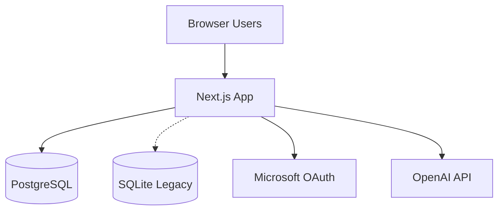

## High-Level Architecture

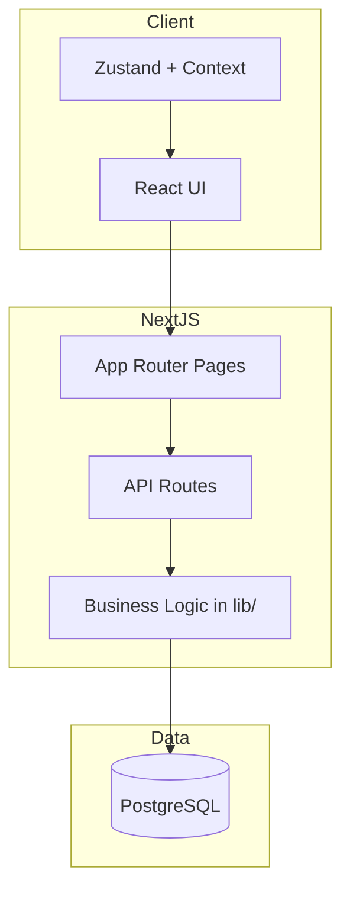

## Key Components

### Frontend

- `app/` for page routing (Next.js App Router).
- `components/`, `hooks/`, `contexts/`, `store/` for UI, state, and shared logic.
- Tree/goal views and time management widgets built as reusable components.

### Backend (API Routes)

- `app/api/` handles authentication, OKRT CRUD, groups, comments, notifications, time blocks, and AI endpoints.
- `lib/` provides shared business logic (auth, database access, notifications, progress propagation, cache updates).

### Data Layer

- PostgreSQL is the primary store.
- SQLite remains for legacy compatibility and migration paths.

## Database ER Diagram

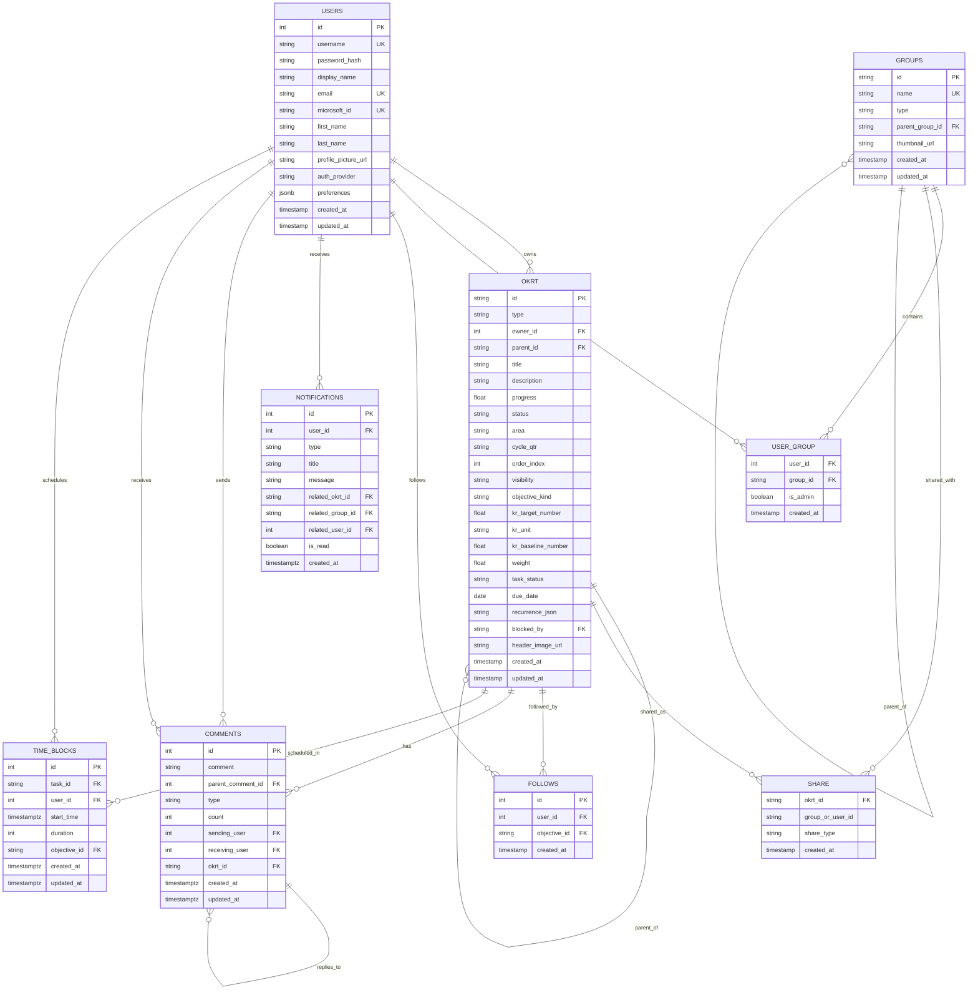

## Core Domains

- Objectives/Key Results/Tasks (OKRT) hierarchy.
- Groups and sharing.
- Comments, rewards, and notifications.
- Time blocks and scheduling.
- AI coaching assistance.

## Data Flow (Representative)

### OKRT Create/Update

1. UI submits a create or update request to `app/api/...`.
2. API validates auth and input, writes to PostgreSQL via `lib/`.
3. API returns updated OKRT data and cache update instructions.
4. UI updates local state (Zustand) and re-renders tree views.

### Authentication

1. UI posts credentials to auth route or uses Microsoft OAuth callback.
2. API verifies credentials and issues JWT-based session cookie.
3. UI fetches `/api/me` to hydrate user state.

## External Integrations

- Microsoft OAuth for enterprise login.
- OpenAI for LLM coaching and text-to-speech endpoints.

## Deployment and Configuration

- Environment variables: database connection, session secret, OAuth credentials, OpenAI key, and `NODE_ENV`.
- Stateless API design supports horizontal scaling.
- Assets are CDN-friendly when deployed on Vercel or similar platforms.

## Security and Access Control

- JWT-based sessions with HTTP-only cookies.
- Permission checks on all protected API routes.
- Ownership and group membership validation for shared data.

## Scalability Notes

- PostgreSQL connection pooling in `lib/`.
- Cache update instructions to reduce full-tree refetching.
- Database indexes on common access paths (OKRT hierarchy, groups, notifications).

## Node Libraries

| Library | Intended purpose | Example source file |
| --- | --- | --- |
| `@emotion/react` | CSS-in-JS engine (MUI peer dependency) | N/A (no direct import found) |
| `@emotion/styled` | Styled component API for Emotion (MUI peer dependency) | N/A (no direct import found) |
| `@mui/material` | Material UI components and styling utilities | `components/OKRTs.js` |
| `@mui/x-tree-view` | MUI Tree View components | `components/OKRTs.js` |
| `@playwright/test` | End-to-end testing framework | N/A (no direct import found) |
| `@prisma/client` | Prisma ORM client | `lib/db.js` |
| `bcryptjs` | Password hashing | `lib/auth.js` |
| `boring-avatars` | Avatar generation | N/A (no direct import found) |
| `d3` | Data visualization core library (dependency of org chart) | N/A (no direct import found) |
| `d3-org-chart` | Org chart visualization | `app/organisation/GroupsView.js` |
| `dotenv` | Load environment variables from `.env` | `scripts/initPostgresDB.js` |
| `jose` | JWT/JOSE utilities | `lib/auth.js` |
| `lucide-react` | Icon set for React | `components/ShareModal.js` |
| `next` | Next.js framework runtime and helpers | `app/api/login/route.js` |
| `next-auth` | Authentication for Next.js | `app/api/auth/[...nextauth]/route.js` |
| `openai` | OpenAI API client | `app/api/text-to-speech/route.js` |
| `pg` | PostgreSQL client | `lib/pgdb.js` |
| `primeicons` | PrimeReact icon set | `app/organisation/page.js` |
| `primereact` | PrimeReact UI components | `components/OKRTModal.js` |
| `react` | React UI library | `components/HeaderBar.js` |
| `react-dom` | React DOM renderer | N/A (no direct import found) |
| `react-icons` | Icon packs for React | `components/LeftMenu.js` |
| `react-markdown` | Markdown rendering in React | `components/MessageMarkdown.jsx` |
| `remark-gfm` | GitHub Flavored Markdown plugin | `components/MessageMarkdown.jsx` |
| `sqlite` | SQLite wrapper utilities | `lib/db.sqlite.backup.js` |
| `sqlite3` | SQLite driver | `lib/db.sqlite.backup.js` |
| `uuid` | UUID generation | `app/api/okrt/route.js` |
| `zustand` | State management | `store/mainTreeStore.js` |

## Page Component Trees (Left Menu)

### Dashboard

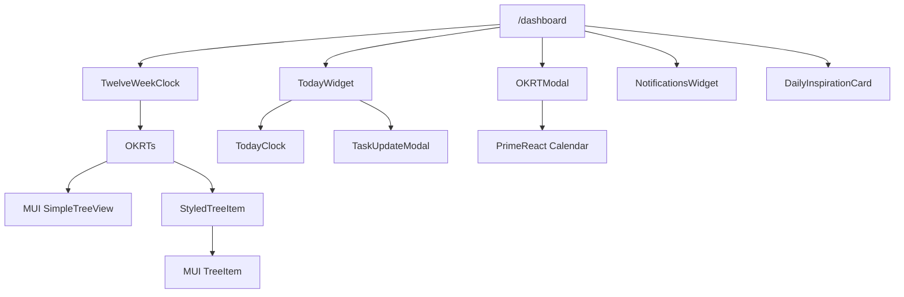

### My OKRs

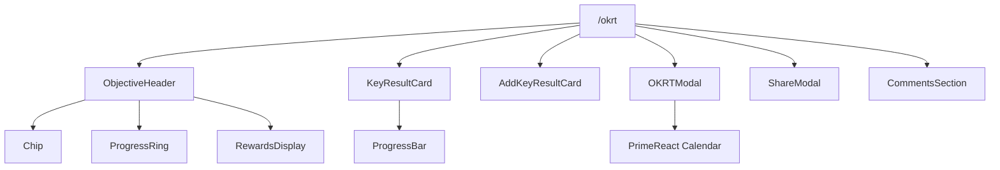

### Schedule

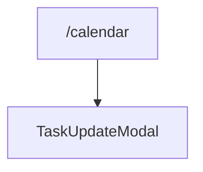

### Shared OKRs

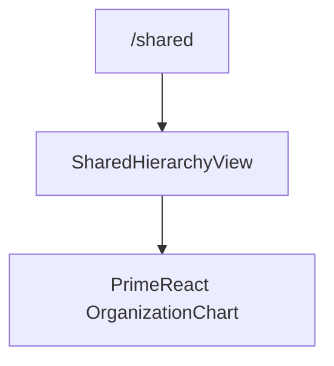

### Business

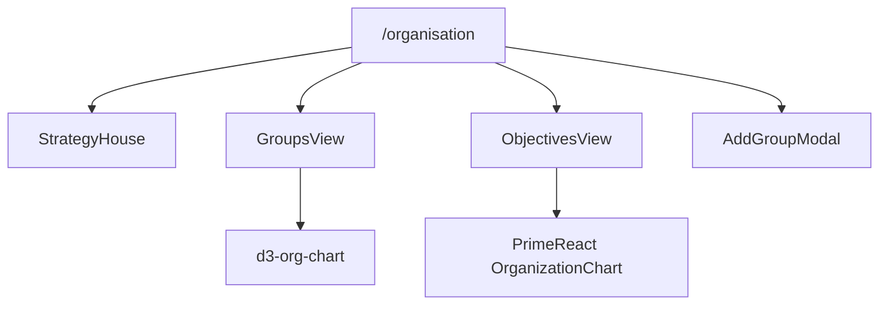

### Members

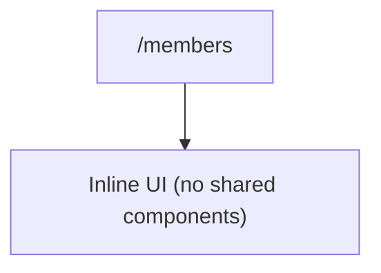

### Coach

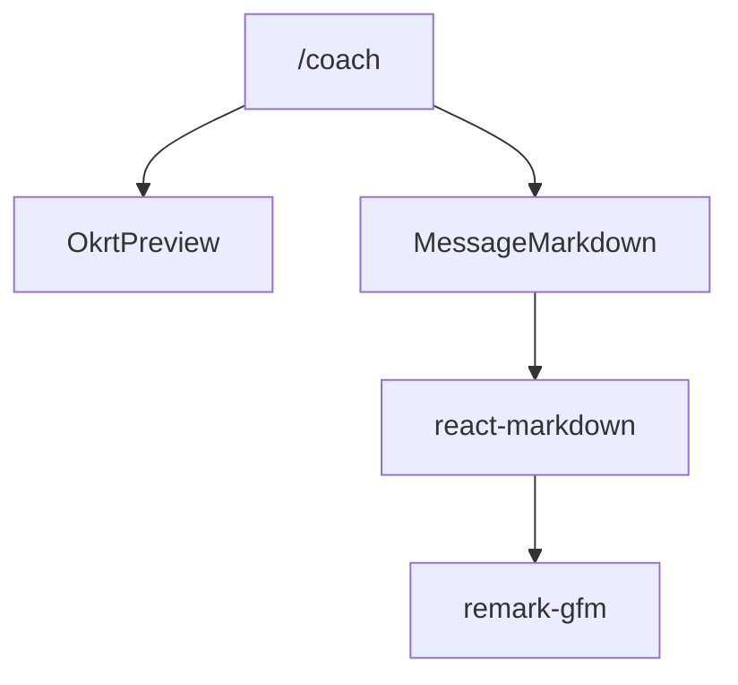

### Notifications

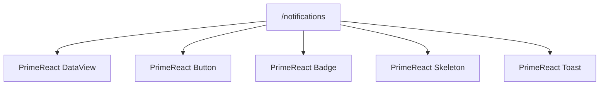

## API Endpoints

| API source file | Endpoint function name | Description | Client file using it | Component | Is Secure |
| --- | --- | --- | --- | --- | --- |
| `app/api/auth/[...nextauth]/route.js` | `GET, POST` | `/api/auth/[...nextauth]` NextAuth (Azure AD OAuth, session) | N/A (NextAuth internal) |  | No |
| `app/api/login/route.js` | `POST` | `/api/login` authenticate and create session | `app/login/page.js` |  | No |
| `app/api/logout/route.js` | `POST` | `/api/logout` clear session cookies | `components/AvatarDropdown.js` |  | No |
| `app/api/signup/route.js` | `POST` | `/api/signup` create user and session | `app/signup/page.js` |  | No |
| `app/api/me/route.js` | `GET` | `/api/me` return current user session | `hooks/useUser.js` |  | Yes |
| `app/api/profile/route.js` | `PUT` | `/api/profile` update current user profile | `app/profile/page.js` |  | Yes |
| `app/api/users/route.js` | `GET` | `/api/users` list/search users | `app/members/page.js` | `MembersPage` | Yes |
| `app/api/users/[id]/route.js` | `PUT` | `/api/users/[id]` update user role/profile | `app/members/page.js` | `MembersPage` | Yes |
| `app/api/groups/route.js` | `GET` | `/api/groups` list groups | `components/ShareModal.js` | `ShareModal` | Yes |
| `app/api/groups/route.js` | `POST` | `/api/groups` create group | `app/organisation/page.js` | `BusinessPage` | Yes |
| `app/api/groups/[id]/route.js` | `GET` | `/api/groups/[id]` get group detail | N/A (no direct client call found) |  | Yes |
| `app/api/groups/[id]/route.js` | `PUT` | `/api/groups/[id]` update group | `app/organisation/page.js` | `BusinessPage` | Yes |
| `app/api/groups/[id]/route.js` | `DELETE` | `/api/groups/[id]` delete group | `app/organisation/page.js` | `BusinessPage` | Yes |
| `app/api/groups/[id]/members/route.js` | `GET` | `/api/groups/[id]/members` list group members | N/A (no direct client call found) |  | Yes |
| `app/api/groups/[id]/members/route.js` | `POST` | `/api/groups/[id]/members` add group members | N/A (no direct client call found) |  | Yes |
| `app/api/groups/[id]/members/[userId]/route.js` | `PUT` | `/api/groups/[id]/members/[userId]` update member role | `components/AddGroupModal.js` | `AddGroupModal` | Yes |
| `app/api/groups/[id]/members/[userId]/route.js` | `DELETE` | `/api/groups/[id]/members/[userId]` remove member | `components/AddGroupModal.js` | `AddGroupModal` | Yes |
| `app/api/groups/admin/route.js` | `GET` | `/api/groups/admin` list admin groups | N/A (no direct client call found) |  | Yes |
| `app/api/okrt/route.js` | `GET` | `/api/okrt` list OKRTs (optional `parent_id`) | `app/okrt/page.js` | `OKRTPage` | Yes |
| `app/api/okrt/route.js` | `POST` | `/api/okrt` create OKRT | `app/okrt/page.js` | `OKRTModal` | Yes |
| `app/api/okrt/[id]/route.js` | `GET` | `/api/okrt/[id]` get OKRT by id | `app/okrt/page.js` | `OKRTPage` | Yes |
| `app/api/okrt/[id]/route.js` | `PUT` | `/api/okrt/[id]` update OKRT | `app/okrt/page.js` | `OKRTPage` | Yes |
| `app/api/okrt/[id]/route.js` | `DELETE` | `/api/okrt/[id]` delete OKRT | `app/okrt/page.js` | `OKRTPage` | Yes |
| `app/api/okrt/[id]/share/route.js` | `GET` | `/api/okrt/[id]/share` list shares | `components/ShareModal.js` | `ShareModal` | Yes |
| `app/api/okrt/[id]/share/route.js` | `POST` | `/api/okrt/[id]/share` create share | `components/ShareModal.js` | `ShareModal` | Yes |
| `app/api/okrt/[id]/share/route.js` | `DELETE` | `/api/okrt/[id]/share` remove share | `components/ShareModal.js` | `ShareModal` | Yes |
| `app/api/okrt/shared/route.js` | `GET` | `/api/okrt/shared` list shared OKRTs | N/A (no direct client call found) |  | Yes |
| `app/api/shared/route.js` | `GET` | `/api/shared` list shared objectives | `components/OKRTModal.js` | `OKRTModal` | Yes |
| `app/api/follow/route.js` | `POST` | `/api/follow` follow objective | `app/shared/page.js` | `SharedPage` | Yes |
| `app/api/follow/route.js` | `DELETE` | `/api/follow` unfollow objective | `app/shared/page.js` | `SharedPage` | Yes |
| `app/api/comments/route.js` | `GET` | `/api/comments` list comments by okrt | `app/shared/[id]/page.js` |  | Yes |
| `app/api/comments/route.js` | `POST` | `/api/comments` create comment or reward | `components/CommentsSection.js` | `CommentsSection` | Yes |
| `app/api/comments/[id]/route.js` | `GET` | `/api/comments/[id]` get comment by id | N/A (no direct client call found) |  | Yes |
| `app/api/comments/[id]/route.js` | `PUT` | `/api/comments/[id]` update comment | N/A (no direct client call found) |  | Yes |
| `app/api/comments/[id]/route.js` | `DELETE` | `/api/comments/[id]` delete comment | N/A (no direct client call found) |  | Yes |
| `app/api/comments/rewards/route.js` | `GET` | `/api/comments/rewards` reward summary | N/A (no direct client call found) |  | Yes |
| `app/api/notifications/route.js` | `GET` | `/api/notifications` list notifications | `app/notifications/page.js` | `NotificationsPage` | Yes |
| `app/api/notifications/route.js` | `POST` | `/api/notifications` mark all as read | `app/notifications/page.js` | `NotificationsPage` | Yes |
| `app/api/notifications/[id]/route.js` | `PUT` | `/api/notifications/[id]` mark as read | `app/notifications/page.js` | `NotificationsPage` | Yes |
| `app/api/notifications/[id]/route.js` | `DELETE` | `/api/notifications/[id]` delete notification | `app/notifications/page.js` | `NotificationsPage` | Yes |
| `app/api/notifications/sse/route.js` | `GET` | `/api/notifications/sse` server-sent events stream | `app/notifications/page.js` | `NotificationsPage` | Yes |
| `app/api/main-tree/progressive/route.js` | `GET` | `/api/main-tree/progressive` progressive main tree load | `hooks/useMainTree.js` |  | Yes |
| `app/api/main-tree/calendar/route.js` | `GET` | `/api/main-tree/calendar` calendar-scope main tree load | `hooks/useMainTree.js` |  | Yes |
| `app/api/time-blocks/route.js` | `GET` | `/api/time-blocks` list time blocks | `app/calendar/page.js` | `CalendarPage` | Yes |
| `app/api/time-blocks/route.js` | `POST` | `/api/time-blocks` create time block | `app/calendar/page.js` | `CalendarPage` | Yes |
| `app/api/time-blocks/[id]/route.js` | `GET` | `/api/time-blocks/[id]` get time block | `app/calendar/page.js` | `CalendarPage` | Yes |
| `app/api/time-blocks/[id]/route.js` | `PUT` | `/api/time-blocks/[id]` update time block | `app/calendar/page.js` | `CalendarPage` | Yes |
| `app/api/time-blocks/[id]/route.js` | `DELETE` | `/api/time-blocks/[id]` delete time block | `app/calendar/page.js` | `CalendarPage` | Yes |
| `app/api/time-blocks/tasks/route.js` | `GET` | `/api/time-blocks/tasks` tasks for scheduling | N/A (no direct client call found) |  | Yes |
| `app/api/tasks/current-cycle/route.js` | `GET` | `/api/tasks/current-cycle` tasks in current cycle | N/A (no direct client call found) |  | Yes |
| `app/api/tasks/[id]/route.js` | `PUT` | `/api/tasks/[id]` update task progress | `components/TodayWidget.js` | `TodayWidget` | Yes |
| `app/api/calendar/route.js` | `GET` | `/api/calendar` external calendar integration | N/A (no direct client call found) |  | Yes |
| `app/api/objectives/search/route.js` | `GET` | `/api/objectives/search` search objectives | N/A (no direct client call found) |  | Yes |
| `app/api/llm/route.js` | `POST` | `/api/llm` AI chat/tooling | `app/coach/page.js` | `CoachPage` | Yes |
| `app/api/text-to-speech/route.js` | `POST` | `/api/text-to-speech` generate audio from text | `app/coach/page.js` | `CoachPage` | No |
| `app/api/speech-to-text/route.js` | `POST` | `/api/speech-to-text` transcribe audio | `app/coach/page.js` | `CoachPage` | Yes |
