# AiME Chat Interaction Sequence Diagram

This document provides a comprehensive sequence diagram for the AiME chat system, showing the interaction flow between the user, frontend page, API route, LLM provider, and various supporting components.

## Overview

The AiME chat system is a sophisticated AI coaching interface that:
- Streams responses from LLM providers (Anthropic, OpenAI, Bedrock, Ollama)
- Supports tool calling for OKRT operations, Jira queries, email access, and more
- Implements a context-aware system with knowledge base injection
- Handles auto-read actions for seamless data fetching
- Manages pagination for Jira queries
- Provides text-to-speech capabilities

## Main Interaction Flow

```mermaid
sequenceDiagram
    participant User
    participant AimePage as AiME Page<br/>(app/aime/page.js)
    participant AimeAPI as AiME API<br/>(app/api/aime/route.js)
    participant LLMHelper as LLM Helper<br/>(anthropicHelper.js)
    participant LLMProvider as LLM Provider<br/>(Anthropic/OpenAI/etc)
    participant ToolAPI as Tool APIs<br/>(OKRT/Jira/Mail)
    participant KnowledgeBase as Knowledge Base<br/>(Domain Docs)

    Note over User,KnowledgeBase: 1. USER SENDS MESSAGE

    User->>AimePage: Types message and clicks send
    AimePage->>AimePage: sendMessage() called
    AimePage->>AimePage: Add user message to state
    AimePage->>AimePage: Prepare payload (last 10 messages)
    
    Note over AimePage: Payload includes:<br/>- messages array<br/>- systemPromptData<br/>- displayName

    AimePage->>AimeAPI: POST /api/aime<br/>{messages, systemPromptData, displayName}

    Note over User,KnowledgeBase: 2. API PROCESSES REQUEST

    AimeAPI->>AimeAPI: Validate session (getSession)
    AimeAPI->>AimeAPI: Extract latestReqMoreInfo from messages
    
    alt Has req_more_info with knowledge IDs
        AimeAPI->>KnowledgeBase: Load knowledge blocks
        KnowledgeBase-->>AimeAPI: Return KB content (markdown)
    end

    AimeAPI->>AimeAPI: Build system prompt<br/>(basic + time context + KB blocks)
    AimeAPI->>AimeAPI: Load requested tool schemas
    AimeAPI->>AimeAPI: Prepare tools array<br/>(req_more_info + requested tools)
    AimeAPI->>AimeAPI: Build llmMessages array

    Note over AimeAPI: Select provider based on<br/>LLM_PROVIDER env var

    AimeAPI->>LLMHelper: Call provider helper<br/>(handleAnthropic/OpenAI/etc)

    Note over User,KnowledgeBase: 3. LLM PROVIDER INTERACTION

    LLMHelper->>LLMHelper: Format messages for provider
    LLMHelper->>LLMHelper: Prepare streaming request
    LLMHelper->>LLMProvider: POST to LLM API<br/>(with system prompt, messages, tools)
    
    LLMProvider-->>LLMHelper: Stream SSE events
    
    Note over LLMHelper: Parse SSE stream and<br/>transform to JSONL format

    loop For each SSE event
        LLMHelper->>LLMHelper: Parse event type
        
        alt content_block_delta (text)
            LLMHelper->>AimeAPI: Emit {type: 'content', data: text}
        else tool_use start
            LLMHelper->>LLMHelper: Buffer tool input chunks
        else tool_use delta
            LLMHelper->>LLMHelper: Append to tool buffer
        else message_stop
            LLMHelper->>LLMHelper: Flush all tool buffers
            LLMHelper->>LLMHelper: Parse tool arguments
            
            alt Tool is action tool
                LLMHelper->>AimeAPI: Emit {type: 'actions', data: actions}
            else Tool is render_chart
                LLMHelper->>AimeAPI: Emit {type: 'chart', data: chart}
            else Tool is req_more_info
                LLMHelper->>AimeAPI: Emit {type: 'req_more_info', data: info}
            end
        end
        
        AimeAPI-->>AimePage: Stream JSONL chunk
    end

    LLMHelper->>AimeAPI: Emit {type: 'usage', data: tokens}
    LLMHelper->>AimeAPI: Emit {type: 'done'}
    AimeAPI-->>AimePage: Complete stream

    Note over User,KnowledgeBase: 4. CLIENT PROCESSES STREAM

    loop For each JSONL chunk
        AimePage->>AimePage: Parse JSON line
        
        alt type: 'content'
            AimePage->>AimePage: Append to textBuffer
            AimePage->>AimePage: Update assistant message
            opt TTS enabled
                AimePage->>AimePage: Add to TTS chunk buffer
                AimePage->>AimePage: Flush to speech queue if ready
            end
        else type: 'preparing_actions'
            AimePage->>AimePage: Set preparingActions flag
        else type: 'actions'
            AimePage->>AimePage: Split into auto-read vs manual actions
            AimePage->>AimePage: Store pendingActions
            AimePage->>AimePage: Store pendingAutoReadActions
        else type: 'chart'
            AimePage->>AimePage: Add to pendingCharts array
            AimePage->>AimePage: Update message with charts
        else type: 'req_more_info'
            AimePage->>AimePage: Store pendingReqMoreInfo
        else type: 'usage'
            AimePage->>AimePage: Accumulate token usage stats
        end
    end

    Note over User,KnowledgeBase: 5. AUTO-READ ACTIONS (if present)

    opt Has pendingAutoReadActions
        AimePage->>AimePage: Check for duplicate/requery guards
        
        alt Jira requery detected
            AimePage->>AimePage: Increment jiraRequeryGuardRef
            alt Exceeded max retries
                AimePage->>AimePage: Show error message
            else Within retry limit
                AimePage->>AimePage: Add system notice to prompt
                AimePage->>AimePage: Retry with updated context
            end
        else Normal auto-read flow
            loop For each auto-read action
                alt Action is Jira query
                    AimePage->>AimePage: fetchJiraPages() with pagination
                    loop While hasMore and under limits
                        AimePage->>AimePage: Update UI with page number
                        AimePage->>ToolAPI: Execute Jira query
                        ToolAPI-->>AimePage: Return page results
                        AimePage->>AimePage: Merge results using helper
                        AimePage->>AimePage: Check stop conditions
                        opt Has nextPageToken
                            AimePage->>AimePage: Update payload for next page
                        end
                    end
                else Other read-only action
                    AimePage->>ToolAPI: Execute tool action
                    ToolAPI-->>AimePage: Return result
                end
            end
            
            AimePage->>AimePage: Build tool exchange messages
            AimePage->>AimePage: Create assistant context message
            AimePage->>AimePage: Append tool results as messages
            AimePage->>AimePage: Retry sendMessage with tool results
        end
    end

    Note over User,KnowledgeBase: 6. REQ_MORE_INFO HANDLING (if present)

    opt Has pendingReqMoreInfo
        AimePage->>AimePage: Merge with accumulated req_more_info
        AimePage->>AimePage: Build merged req_more_info object
        AimePage->>AimePage: Create hidden req_more_info message
        AimePage->>AimePage: Build system prompt payload<br/>(with mainTree sections)
        
        alt Needs chart width
            AimePage->>AimePage: Add CHAT_WINDOW_WIDTH_PX hint
        end
        
        AimePage->>AimePage: Check for duplicate requests
        
        alt Not duplicate and within retry limit
            AimePage->>AimePage: Increment autoRetryCountRef
            AimePage->>AimePage: Update lastPromptFingerprintRef
            AimePage->>AimePage: Retry sendMessage with context
        else Duplicate or exceeded retries
            AimePage->>AimePage: Show error message
        end
    end

    Note over User,KnowledgeBase: 7. DISPLAY RESULTS

    AimePage->>AimePage: Finalize assistant message
    AimePage->>AimePage: Set loading = false
    AimePage->>User: Display response with actions/charts

    opt User approves manual actions
        User->>AimePage: Click Execute Actions
        AimePage->>AimePage: handleExecuteActions()
        loop For each action
            AimePage->>ToolAPI: Execute action (allowWrite: true)
            ToolAPI-->>AimePage: Return result
        end
        AimePage->>AimePage: Show success/error feedback
        opt Has cache updates
            AimePage->>AimePage: Update mainTree store
        end
    end
```

## Key Components Explained

### 1. AiME Page (app/aime/page.js)
**Responsibilities:**
- User interface and interaction handling
- Message state management
- Stream processing and parsing
- Auto-read action execution
- Jira pagination handling
- Tool action execution
- Text-to-speech integration
- Retry logic and guard mechanisms

**Key Functions:**
- `sendMessage()` - Main message sending orchestrator
- `executeToolActionRequest()` - Executes individual tool actions
- `buildToolExchangeMessages()` - Creates synthetic tool exchange for LLM
- `fetchJiraPages()` - Handles Jira pagination with stop conditions
- `buildSystemPromptPayload()` - Constructs context from mainTree

### 2. AiME API Route (app/api/aime/route.js)
**Responsibilities:**
- Session validation
- System prompt construction
- Knowledge base loading
- Tool schema management
- Provider selection and delegation
- Request/response logging

**Key Functions:**
- `POST()` - Main route handler
- `buildSystemPrompt()` - Assembles complete system prompt
- `loadKnowledgeBlocks()` - Fetches KB content
- `getReqMoreInfoTool()` - Defines req_more_info tool schema
- `extractActionsFromArgs()` - Parses tool arguments

### 3. LLM Helpers (app/api/aime/llm/)
**Responsibilities:**
- Provider-specific API formatting
- Streaming response handling
- SSE to JSONL transformation
- Tool call parsing and buffering
- Error handling and logging

**Supported Providers:**
- `anthropicHelper.js` - Claude models via Anthropic API
- `openAIHelper.js` - GPT models via OpenAI API
- `bedrockHelper.js` - Claude via AWS Bedrock
- `ollamaHelper.js` - Local models via Ollama

### 4. Knowledge Base
**Purpose:** Domain-specific documentation injected into context

**Available Knowledge Bases:**
- `aime-overview` - App navigation and features
- `okrt-domain` - OKRT rules and operations
- `aime-charts` - Chart rendering specifications
- `groups-domain` - Group management rules
- `ms-mail-domain` - Outlook mail integration
- `jira-domain` - Jira integration overview
- `jira-initiative-domain` - Initiative field catalog
- `jira-leave-domain` - Leave request field catalog
- `jira-link-domain` - OKRT-Jira linking rules
- `confluence-domain` - Confluence search integration

### 5. Tool APIs
**Available Tool Actions:**
- **OKRT Actions** (`emit_okrt_actions`) - Create/update/delete objectives, key results, tasks
- **OKRT Share Actions** (`emit_okrt_share_actions`) - Share/unshare objectives
- **Group Actions** (`emit_group_actions`) - Manage groups and membership
- **MS Mail Actions** (`emit_ms_mail_actions`) - List/preview/read emails
- **Jira Query Actions** (`emit_jira_query_actions`) - JQL queries with pagination
- **Jira Link Actions** (`emit_jira_link_actions`) - Link/unlink Jira tickets to OKRTs
- **Confluence Query Actions** (`emit_confluence_query_actions`) - CQL search
- **Render Chart** (`render_chart`) - Display bar/pie/line charts

## Important Patterns

### Auto-Read vs Manual Actions
- **Auto-read actions**: Read-only operations executed automatically (Jira queries, email listing)
- **Manual actions**: Write operations requiring user approval (create/update/delete OKRTs)

### req_more_info Pattern
The LLM can request additional context via the `req_more_info` tool:
- **data.sections**: MainTree data sections (myOKRTs, sharedOKRTs, groups, etc.)
- **domainKnowledge.ids**: Knowledge base documents
- **tools.ids**: Tool schemas for action emission

This creates a retry loop where the API enriches the context and resends the request.

### Jira Pagination
Special handling for Jira queries to fetch multiple pages:
1. Execute initial query
2. Check for `hasMore` or `nextPageToken`
3. Fetch subsequent pages with updated payload
4. Merge results using helper functions
5. Apply stop conditions (max pages, max issues, timeout, duplicates)
6. Return aggregated results

### Guard Mechanisms
Multiple guards prevent infinite loops:
- **Jira Requery Guard**: Prevents repeated identical Jira queries
- **Duplicate Auto-Read Guard**: Blocks duplicate read-only actions
- **Duplicate req_more_info Guard**: Stops requesting same context
- **Max Retry Limits**: Caps retry attempts for all patterns

## Data Flow Summary

1. **User Input** → AiME Page state
2. **Message Payload** → AiME API (last 10 messages + context)
3. **System Prompt** → Built from base + time + KB + data sections
4. **LLM Request** → Provider-specific API with tools
5. **Streaming Response** → SSE events transformed to JSONL
6. **Client Processing** → Parse chunks, update UI, handle actions
7. **Auto-Read Execution** → Fetch data, build tool exchange, retry
8. **req_more_info Handling** → Load context, retry with enriched prompt
9. **Manual Actions** → User approval, execute with write permissions
10. **State Updates** → Refresh mainTree cache, show feedback

## Missing Components?

Based on the analysis, the main components are:
1. ✅ **AiME Page** - Frontend chat interface
2. ✅ **AiME API Route** - Backend orchestrator
3. ✅ **LLM Helpers** - Provider-specific handlers
4. ✅ **LLM Providers** - External AI services
5. ✅ **Knowledge Base** - Domain documentation
6. ✅ **Tool APIs** - OKRT, Jira, Mail, etc.
7. ✅ **MainTree Store** - Client-side data cache
8. ✅ **Session/Auth** - User authentication
9. ✅ **Jira Pagination Helper** - Pagination utilities
10. ✅ **TTS System** - Text-to-speech integration

Additional supporting components:
- **Rate Limiting** (`lib/rateLimit.js`)
- **LLM API Logger** (`lib/llmApiLogger.js`)
- **Avatar Generator** (for user display)
- **Theme Manager** (for UI theming)

The architecture is comprehensive and well-structured!
